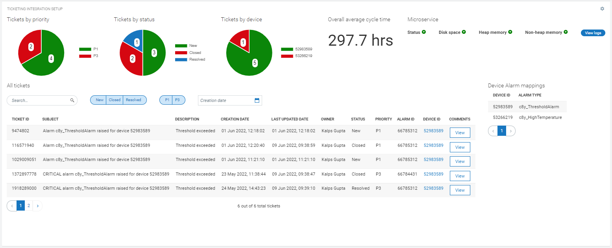

# Ticketing Integration Setup Widget for Cumulocity IoT

This widget is dependent on Cumulocity IoT Ticketing Integration microservice. It allows to configure the microservice and see the tickets list and charts from ticketing platform.

### Installation - for the dashboards using Runtime Widget Loader
1. Download the latest `c8y-ticketing-integration-setup-widget-{version}.zip` file from the Releases section.
2. Make sure you have Application Builder app installed.
3. Open a dashboard.
4. Click `more...`.
5. Select `Install Widget` and follow the instructions.

### Configuration - to add the widget on dashboard
1. Make sure you have successfully installed the widget.
2. Click on `Add widget`.
3. Choose `Ticket Integration Setup` widget.
4. `Title` is the title of widget. Provide a relevant name. You may choose to hide this. Go to `Appearance` tab and choose `Hidden` under `Widget header style`.
5. `Platform` is ticketing platform. 
    - Choose `webMethods AgileApps` to integrate with webMethods AgileApps directly.
        - `Tenant url` is base url of ticketing platform. It must not end on '/'. Example: https://testtenant.agileappslive.com
        - `Username` is username of AgileApps tenant account.
        - `Password` is password of AgileApps tenant account.
        - `Account id` is customer account record id to which all the tickets created will be related to.
    - Choose `External REST APIs` to integrate with any ticketing platform using custom integration.
        - `Tenant url` is base url of custom APIs. It must not end on '/'.
        - `Username` is username of user account to access the APIs using basic authentication.
        - `Password` is password of user account to access the APIs using basic authentication.
        - `Download Swagger` to download the swagger file. Swagger file define the APIs that are expected by Ticketing Integration Microservice.
6. `Ticket record template url` is the template url for ticket record in the ticketing platform. Ticket id is defined by '{id}' placeholder which gets replaced by actual ticket id. Example: https://testticketingplatform.com/records/{id}.
7. `Create tickets automatically on device alarm mapping matched` controls whether tickets should be created automatically on alarm creation or not.
8. `Change alarm status to ACKNOWLEDGE automcatically after creating ticket` controls whether to change alarm status to 'Acknowledge' automatically after ticket creation or not.
9. Click `Save configuration` to save ticketing platform configuration.
10. Add or remove `Device Alarm Mappings` and click Save Mappings buttons. Mappings means for which device id and alarm type ticket needs to be created.
11. `Maximum total tickets` is how many total tickets need to be fetched from the ticketing platform.
12. `Tickets page size` is how many tickets need to be shown in the table at once.
13. Add and remove `Chart colors` for tickets by priority, tickets by status and tickets by device charts. 
14. Click `Save` to add the widget on the dashboard.
15. In case you see unexpected results on the widget, refer to browser console to see if there are error logs.

### Development - to do the enhancements and testing locally
1. Clone the repository on local machine using `git clone https://github.com/SoftwareAG/c8y-ticketing-integration-setup-widget.git`.
2. Run `npm install` to download the module dependencies.
3. Install c8ycli `npm install -g @c8y/cli` if not already.
4. Run `c8ycli server -u https://your_tenant_url` to start the server.
5. Go to `http://localhost:9000/apps/cockpit/` in the browser to view and test your changes.
6. (Optional) push the changes back to this repository.

### Build - to create a new build for the Runtime Widget Loader
1. Finish the development and testing on your local machine.
2. Run `gulp` to start the build process. Run `npm install -g gulp` to install gulp if not already.
3. Use `c8y-ticketing-integration-setup-widget-{version}.zip` file in the `dist` folder as a distribution.

------------------------------

These tools are provided as-is and without warranty or support. They do not constitute part of the Software AG product suite. Users are free to use, fork and modify them, subject to the license agreement. While Software AG welcomes contributions, we cannot guarantee to include every contribution in the master project.

------------------------------

For more information you can Ask a Question in the [TECHcommunity Forums](http://tech.forums.softwareag.com/techjforum/forums/list.page?product=cumulocity).
  
  
You can find additional information in the [Software AG TECHcommunity](http://techcommunity.softwareag.com/home/-/product/name/cumulocity).